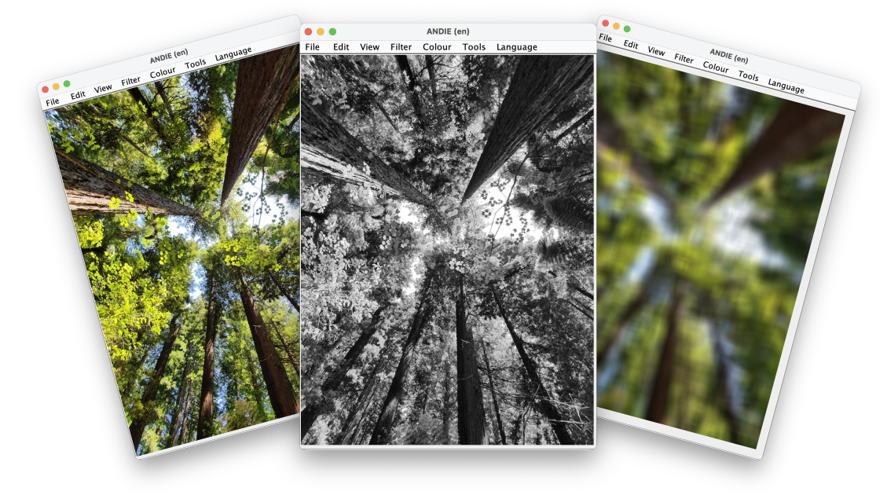

<p align="center">
    <h1 align="center"> ANDIE: A Non-Destructive Image Editor </h1>
    <h6 align="center"> University of Otago Group Project - COSC202</h6>

  <p align="center">
   Authors: Sola Woodhouse, Xavier Nuttall, James Robiony-Rogers, Jess Tyrrell & Jack McDonnell
  </p>
</p>

---

## Overview 
ANDIE is a Java-based image processing and editing application that leverages the Swing library. It adopts a non-destructive approach to image editing by preserving the original data and a sequence of operations performed. By applying the operations to a copy of the original image, ANDIE ensures that no information is lost. This approach allows us to implement undo and redo operations easily.

## File Structure 
- `src/cosc202/andie` - Contains all the high level files ANDIE
- `src/cosc202/andie/LanguageBundles` - Contains all the translated files of localised strings in the ANDIE GUI 
- `src/cosc202/andie/actions` - Contains all the action classes used in ANDIE's menu bar
- `src/cosc202/andie/colour` - Contains all the colour filter classes found under the colour menu
- `src/cosc202/andie/filter` - Contains all the filter classes found under the filter menu
- `src/cosc202/andie/tool` - Contains all the image manipulation classes found under the tools menu
- `src/test/cosc202/andie` - Contains all the JUnit tests for ANDIE 
- `src/icons` - Contains all the icon files used in ANDIE
- `lib` - JUnit Unit Testing Library


## Running it Locally 

1. Clone the repo using Git
```sh
git clone https://altitude.otago.ac.nz/team/project-andie.git
```
2. CD into the project directory and open in Visual Studio Code
```sh
cd project-andie
code .
```
3. Run `ANDIE.java` - found under `src/cosc202/andie` directory

## View Project


## Project Contribution 
Below is a collapsible section documenting how each member of our group contributed to ANDIE over the course tof the project.

<details open>
    <summary>ANDIE: Part One</summary>

---
### Feature Title
- **Contributors:** 
- **Description:**
- **Access:** 
- **Testing:**
- **Limitations:** 

---
### Sharpen Filter 
- **Contributors:** Jess Tyrrell
- **Description:** The Sharpen filter is implemented as a convolution. The resulting effect is enhances the differences between adjacent pixels, making the image appear sharper.
- **Access:** Located under the `Filter` menu
- **Testing:**
- **Limitations:** Reduces the image size by the width of the kernel.

---
### Gaussian Blur Filter 
- **Contributors:** James Robiony-Rogers
- **Description:** The Gaussian blur filter is implemented as a convolution providing a reasonable approximation to the blurring caused by out-of-focus camera lenses and other natural blurring effects.
- **Access:** Located under the `Filter` menu
- **Testing:** I developed a JUnit test to test weather `apply()` method was returning an image. I was unable to test the private methods in the class as they were not accessible.
- **Limitations:** Reduces the image size by the width of the kernel.

---
### Median Filter  
- **Contributors:** Sola Woodhouse
- **Description:** The median filter takes all of the pixel values in a local neighborhood and sorts them. The new pixel value is then the middle value (the median) from the sorted list.
- **Access:** Located under the `Filter` menu
- **Testing:** A 2x2 image was used to check the median filter was selecting the correct median values in the even median case. These values were read using `PixelPeek` testing if all the pixels were the same colour. A variety of image sizes were chosen to see if the filter was correctly looping over each pixel checking the expected array length vs observed length. Then a 3x3 image was used checking the middle pixels colours using `PixelPeek`.
- **Limitations:** Compared with other filters Median Filter runs quite slow.

---
### Brightness & Contrast Adjustment   
- **Contributors:** Jack McDonnell
- **Description:** The Brightness & Contrast adjustment, as the names suggests, adjusts the brightness and contrast of the image. 
- **Access:** Located under the `Color` menu
- **Testing:** 
- **Limitations:** 

---

### Resize
- **Contributors:** Xavier Nuttall
- **Description:** The Resize operation takes the image and scales it by a user chosen amount.
- **Access:** Located under `Tools` menu
- **Testing:** Scaled image checking width and height of image after the scaling operations
- **Limitations:** BufferedImage only supports images with an area less than javas max int, so theres a limit to how big you can scale.
  
---

### Rotate
- **Contributors:** Xavier Nuttall
- **Description:** The Rotate operation rotates by swaps pixels according to an offset matrix operation, according to an angle chosen by the user.
- **Access:** Located under `Tools` menu
- **Testing:** The `PixelPeek` tool was used to check if the pixel rgba's were correct after performing a rotation. For the NxN image case a 2x2 image was used checking the colour at each pixel location before and after the rotation. When testing the offset was correct for NxM images a 2x3 and 3x2 image was used.
- **Limitations:** Only supports rotation in multiples of 90°
  
---
### Image Flip
- **Contributors:** Sola Woodhouse
- **Description:** The Image flip operation takes the pixels in an image and swap them over to flip an image in a direction chosen by the user
- **Access:** Located under the `Tools` menu
- **Testing:** `PixelPeek` was used checking the expected desination of a pixel after having been flipped. A variety of images were used to ensure the flip was occuring correctly.
- **Limitations:** 

--- 
### Multilingual Support   
- **Contributors:** Sola Woodhouse, James Robiony-Rogers
- **Description:** ANDIE now has multilingual support! This feature was implemented using Language Resource Bundles allowing us to easily add new languages to ANDIE. In order to translate into the non English languages, we used a mix of Google Translate and ChatGPT.
- **Supported Languages:** English, Spanish, German, Portuguese, Italian & Chinese
- **Access:** Located under the `Language` menu
- **Testing:** Review and testing of the feature branch was done by members of the group. 
- **Limitations:** No one in the group speaks any of the non English languages in order to verify the accuracy of the translations.

---
### Exception Handling   
- **Contributors:** Jack McDonnell, James Robiony-Rogers, Xavier Nuttall
- **Description:** Exceptions are now handled in ANDIE. This is done using the `ExceptionHandler` class. This class is used to catch any exceptions that occur during the execution of ANDIE and display a message to the user using the JOptionPanel.
- **Testing:** 
  - Running ANDIE with a primary language that is not en_NZ would throw an exception breaking ANDIE. This was fixed by catching the exception and setting the default language back to en_NZ.

---
### Other Error Avoidance/Prevention (Usability Edge Cases)
- **Contributors:** James Robiony-Rogers, Jack McDonnell, Sola Woodhouse, Xavier Nuttall, Jess Tyrrell
- **Description:** 
- **Access:** 
- **Testing:** 
- **Limitations:** 

</br></br>

</details>


<details>
    <summary>ANDIE: Part Two</summary>

---
### Feature Title
- **Contributors:** 
- **Description:**
- **Access:** 
- **Testing:**
- **Limitations:** 

---
### Image Export
- **Contributors:** Jess Tyrrell, Xavier Nuttall
- **Description:** The `Export` option under the `File` menu allows the user to pick a new filename and filetype when saving the current edited image.
- **Access:** Located under the `File` menu
- **Testing:**
- **Limitations:** 


</details>

## Further Development  
Throughout the project we have been tracking features, bugs and further development using Jira. Here are some of the features we thought of to further develop ANDIE:

- [ ] Feature 1... 
- [ ] Feature 2...
