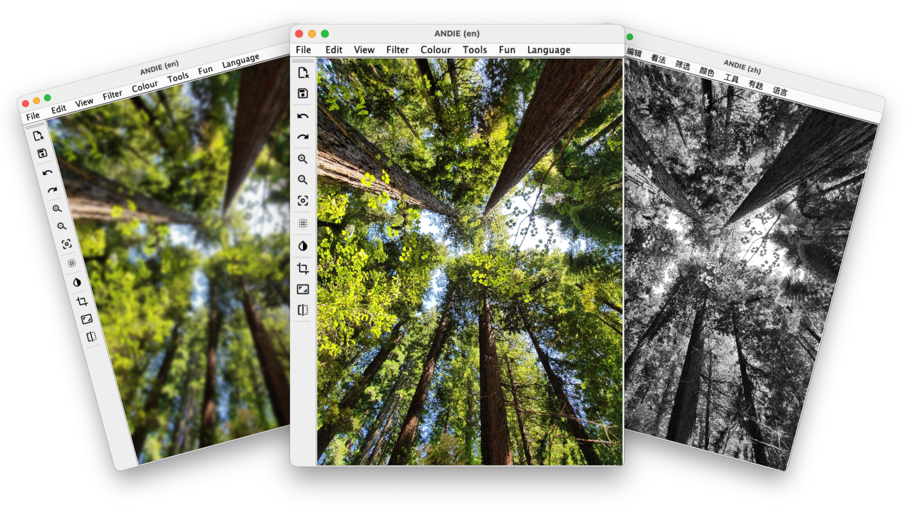

<p align="center">
    <h1 align="center"> ANDIE: A Non-Destructive Image Editor </h1>
    <h6 align="center"> University of Otago Group Project - COSC202</h6>

  <p align="center">
   Authors: Sola Woodhouse, Xavier Nuttall, James Robiony-Rogers, Jess Tyrrell & Jack McDonnell
  </p>
</p>

---

## Overview 
ANDIE is a Java-based image processing and editing application that leverages the Swing library. It adopts a non-destructive approach to image editing by preserving the original data and a sequence of operations performed. By applying the operations to a copy of the original image, ANDIE ensures that no information is lost. This approach allows us to implement undo and redo operations easily.

## File Structure 
- `src/cosc202/andie` - Contains all the high level files ANDIE
- `src/cosc202/andie/LanguageBundles` - Contains all the translated files of localised strings in the ANDIE GUI 
- `src/cosc202/andie/actions` - Contains all the action classes used in ANDIE's menu bar
- `src/cosc202/andie/colour` - Contains all the colour filter classes found under the colour menu
- `src/cosc202/andie/filter` - Contains all the filter classes found under the filter menu
- `src/cosc202/andie/tool` - Contains all the image manipulation classes found under the tools menu
- `src/test/cosc202/andie` - Contains all the JUnit tests for ANDIE 
- `src/icons` - Contains all the icon files used in ANDIE
- `lib` - JUnit Unit Testing Library


## Running it Locally 

#### Running the `.jar` file 
1. Download the `ANDIE.jar` file from the root directory of this repository 
2. Double click the `ANDIE.jar` file to run it

#### Cloning the repository  

1. Clone the repo using Git
```sh
git clone https://altitude.otago.ac.nz/team/project-andie.git
```
2. CD into the project directory and open in Visual Studio Code
```sh
cd project-andie
code .
```
3. Run `ANDIE.java` - found under `src/cosc202/andie` directory

## View Project


## Project Contribution 
Below is a collapsible section documenting how each member of our group contributed to ANDIE over the course tof the project.

<details>
    <summary>ANDIE: Part One</summary>

---
### Sharpen Filter 
- **Contributors:** Jess Tyrrell
- **Description:** The Sharpen filter is implemented as a convolution. The resulting effect is enhances the differences between adjacent pixels, making the image appear sharper.
- **Access:** Located under the `Filter` menu
- **Testing:**
- **Limitations:** Reduces the image size by the width of the kernel.

---
### Gaussian Blur Filter 
- **Contributors:** James Robiony-Rogers
- **Description:** The Gaussian blur filter is implemented as a convolution providing a reasonable approximation to the blurring caused by out-of-focus camera lenses and other natural blurring effects.
- **Access:** Located under the `Filter` menu
- **Testing:** I developed a JUnit test to test weather `apply()` method was returning an image. I was unable to test the private methods in the class as they were not accessible.
- **Limitations:** Reduces the image size by the width of the kernel.

---
### Median Filter  
- **Contributors:** Sola Woodhouse
- **Description:** The median filter takes all of the pixel values in a local neighborhood and sorts them. The new pixel value is then the middle value (the median) from the sorted list.
- **Access:** Located under the `Filter` menu
- **Testing:** A 2x2 image was used to check the median filter was selecting the correct median values in the even median case. These values were read using `PixelPeek` testing if all the pixels were the same colour. A variety of image sizes were chosen to see if the filter was correctly looping over each pixel checking the expected array length vs observed length. Then a 3x3 image was used checking the middle pixels colours using `PixelPeek`.
- **Limitations:** Compared with other filters Median Filter runs quite slow.

---
### Brightness & Contrast Adjustment   
- **Contributors:** Jack McDonnell
- **Description:** The Brightness & Contrast adjustment, as the names suggests, adjusts the brightness and contrast of the image. 
- **Access:** Located under the `Color` menu
- **Testing:** 
- **Limitations:** 

---

### Resize
- **Contributors:** Xavier Nuttall
- **Description:** The Resize operation takes the image and scales it by a user chosen amount.
- **Access:** Located under `Tools` menu
- **Testing:** Scaled image checking width and height of image after the scaling operations
- **Limitations:** BufferedImage only supports images with an area less than javas max int, so theres a limit to how big you can scale.
  
---

### Rotate
- **Contributors:** Xavier Nuttall
- **Description:** The Rotate operation rotates by swaps pixels according to an offset matrix operation, according to an angle chosen by the user.
- **Access:** Located under `Tools` menu
- **Testing:** The `PixelPeek` tool was used to check if the pixel rgba's were correct after performing a rotation. For the NxN image case a 2x2 image was used checking the colour at each pixel location before and after the rotation. When testing the offset was correct for NxM images a 2x3 and 3x2 image was used.
- **Limitations:** Only supports rotation in multiples of 90°
  
---
### Image Flip
- **Contributors:** Sola Woodhouse
- **Description:** The Image flip operation takes the pixels in an image and swap them over to flip an image in a direction chosen by the user
- **Access:** Located under the `Tools` menu
- **Testing:** `PixelPeek` was used checking the expected desination of a pixel after having been flipped. A variety of images were used to ensure the flip was occuring correctly.
- **Limitations:** 

--- 
### Multilingual Support   
- **Contributors:** Sola Woodhouse, James Robiony-Rogers
- **Description:** ANDIE now has multilingual support! This feature was implemented using Language Resource Bundles allowing us to easily add new languages to ANDIE. In order to translate into the non English languages, we used a mix of Google Translate and ChatGPT.
- **Supported Languages:** English, Spanish, German, Portuguese, Italian & Chinese
- **Access:** Located under the `Language` menu
- **Testing:** Review and testing of the feature branch was done by members of the group. 
- **Limitations:** No one in the group speaks any of the non English languages in order to verify the accuracy of the translations.

---
### Exception Handling & Error Avoidance/Prevention *(Usability Edge Cases)*
- **Contributors:** Jack McDonnell, James Robiony-Rogers, Xavier Nuttall, Sola Woodhouse, Jess Tyrrell
- **Description:** Exceptions are now handled in ANDIE. This is done using the `ExceptionHandler` class. This class is used to catch any exceptions that occur during the execution of ANDIE and display a message to the user using the JOptionPanel. We have also gone through ANDIE and added error avoidance/prevention to avoid any exceptions being thrown in the first place. This includes checking for null values, invalid inputs & testing edge cases.
- **Testing:** One example of how we have been testing error avoidance and exception handling was during development of Multilingual Support.  Running ANDIE with a primary language that is not en_NZ would throw an exception breaking ANDIE. This was fixed by catching the exception and setting the default language back to en_NZ.

---

</br></br>

</details>


<details>
    <summary>ANDIE: Part Two</summary>

---
### Macros for record and replay
- **Contributors:** Jess Tyrrell, Xavier Nuttall
- **Description:** The `Record` option under `Edit` menu allows the user the record a series of operations, and export them in a .ops file. The `Import` option under the  `File` menu then allows the user to import the ops file to apply the same operations again. 
- **Access:** Located under the `Edit` menu (for recording) and the `File` menu (for importing .ops)
- **Testing:** A variety of macros were recorded then imported, an inspection of the ops stack was performed to see if the import/recording was successful.
- **Limitations:** 
---

### Image Export
- **Contributors:** Jess Tyrrell, Xavier Nuttall
- **Description:** The `Export` option under the `File` menu allows the user to pick a new filename and filetype when saving the current edited image.
- **Access:** Located under the `File` menu
- **Testing:** Reviewers tested the feature by exporting images in a variety of file types and checking the exported images had the applied operations.
- **Limitations:** 
---
### ToolBar 
- **Contributors:** James Robiony-Rogers
- **Description:**  ANDIE now has a repositionable toolbar for common operations. You can drag the toolbar to any side of the window as well as pop it out of the window entirely. Simply drag it using the double lines at the top of the toolbar.
- **Access:** Located on the left side of the ANDIE window
- **Testing:** Below are the test cases used to test the toolbar:
  - ***Repositioning:*** Drag the toolbar using the double lines at the top.
  - ***Disabled Buttons:*** Exit out the open image window and try using the buttons
  - ***Enabled Buttons:*** Open an image and try using some of the common operations
- **Limitations:** Dragging the toolbar into a separate window and then opening another application will result in the toolbar window persisting on top of the other application. This is because the toolbar window is set to always be on top of other windows. This is a limitation of the Swing library.
---
### Crop to selection
- **Contributors:** Jack McDonnell, Jess Tyrrell
- **Description:**  Implement image cropping based on a selected region in the image.
- **Access:** Located under the `Tool` menu and on the toolbar.
- **Testing:** Testing was done by printing the corner locations of the selected area to ensure that the crop was selecting the correct area of the image. It was then tested on various features including the zoom functions as well as resize to ensure crop worked on images that were no longer the size of the original image.
- **Limitations:** 
---
### Extended Filters 
- **Contributors:** Xavier Nuttall, James Robiony-Rogers
- **Description:** Convolution filters such as the Gaussian Blur and Mean Blur filters now extend their filtering all the way to the edge of the image rather than stopping at the edge of the kernel.
- **Access:** Access to this has been implemented into all the filters using a convolution, thus they can be found under the `Filter` menu.
- **Testing:** Testing started by ensuring the size of the visible image wasn't altered when applying these filters (the original convolution removed the edges). Following this, a visual subjective inspection was required around the edges as what should happen at the edges isn't a concretely defined equation. Reviewers used the filters on a variety of images to ensure the filters were working correctly.
- **Limitations:** The convolutions will take ~5-10% longer based on kernel size.

---
### Filters with negative results
- **Contributors:** Xavier Nuttall
- **Description:** The filter implementation has been updated to allow applying an offset to account for both positive and negative numbers in the result of a convolution. This allows for filters such as the Emboss and Edge Detection filters to be implemented.
- **Access:** Located under the `Filter` menu.
- **Testing:** Each part of the 3 step process of applying a negative filter was tested individually first. 
  - First the kernel separation was tested, seeing if the filter would correctly create 2 kernels from a single input kernel. 
  - Then applying these 2 convolutions were tested by `PixelPeek`ing the output. 
  - Finally for the recentering equation and composition of the 2 images. This was done by comparing the negative, and the positive images with the output composition with `PixelPeek`.
- **Limitations:** N/A

---
### Emboss and edge detection filters
- **Contributors:** Xavier Nuttall
- **Description:** ANDIE now has the ability to apply the emboss and edge detection filters to an image.
- **Access:** Located under the `Filter` menu.
- **Testing:** This feature was tested using a checkerboard image and the resulting lines were analysed, to ensure the filter was correctly detecting edges and embossing in the direction described.
- **Limitations:** 

---
### Keyboard shortcuts
- **Contributors:** James Robiony-Rogers
- **Description:** ANDIE now has keyboard shortcuts for commonly used operations. These shortcuts are listed in the menu bar next to the operation they are associated with. Keyboard shortcuts are available on Windows, MacOS and Linux with their respective key combinations.
- **Access:** The keyboard shortcut for each operation can be found next to the operation in the menu bar.
- **Testing:** Reviewers were asked to test the keyboard shortcuts on their respective operating systems.
- **Limitations:** We have purposefully not allocated keyboard shortcuts to some less common operations. This is to avoid the user accidentally triggering an operation they did not intend to.

---
### Mouse Selection of Rectangular regions
- **Contributors:** Sola Woodhouse, Xavier Nuttal
- **Description:** This feature (`ClickListener`) allows for other features such as draw shape and crop to be used in a more user friendly way.
- **Testing:** Tested using a `Selection` which printed the corner positions every time it was called, this was to ensure the mouse selection wasn't passing points outside of the image area. When testing this selection was still correct after `Zoom In` and `Zoom Out` an AutoHotKey script was used to perform consistent repeatable movements, these observations were compared against the expected results. Then further tested by applying it with the draw function.
- **Limitations:** N/A

---
### Drawing Shapes
- **Contributors:** Sola Woodhouse
- **Description:** Users are now able to draw rectangles, ovals, and lines in ANDIE with their mouse, and can choose whether the shape is filled or not and the thickness of their line.
- **Access:** Located under the `Tools` menu.
- **Testing:** Tested by using `PixelPeek` and `ClickListener` to check the colour of the correct pixels are changed.
- **Limitations:** 

---
</details>

## Further Development  
Throughout the project we have been tracking features, bugs and further development using Jira. Here are some of the features we thought of to further develop ANDIE:

<details>
  <summary>Click here to see how we developed ANDIE even further</summary>


### Roll  
- **Contributors:** Jess Tyrrell
- **Description:** This feature will open the user's default browser and take them to a fun link. It support use on mac, 
windows and linux.
- **Access:** Located under the `Tools` menu
- **Testing:** Attempted to click the roll button on all operating systems. 
- **Limitations:** N/A
---
### Auto resize of window on opening of file
- **Contributors:** Jess Tyrrell, Jack McDonnell
- **Description:** This feature automatically resizes the ANDIE window to perfectly contain the image and all other components (pack). To allow for this, the opened image is also scaled/zoomed to a reasonable size. There is a minimum height and width of 300 pixels and maximum height and width determined by the users screen size. If both the height and width of the image is less than the minimum then the image is zoomed by 150% until either the minimum width or height is exceeded. If either the original image's height or width exceeds the maximum then the image is scaled by 1/1.5 (zoom of 66.7%) until both are less than their respective maximums. 
- **Access:** Occurs automatically when a file is opened 
- **Testing:** Tested on a variety of images of different sizes and aspect ratios.
- **Limitations:** 
--- 

### Live Filter Previewing 
- **Contributors:** Jess Tyrrell
- **Description:** ANDIE now allows the user to preview filters before applying them to the image.
- **Access:** Access to this feature is enabled when the user selects a filter they want to apply and adjusts the settings for that filter. The preview will update as the user adjusts the settings.
- **Testing:** Reviewers tested the feature using a variety of images and filters to make sure it was working correctly.
- **Limitations:** Previewing filters on large images can be slow.
---

### Revert to original
- **Contributors:** Jess Tyrrell
- **Description:** `Revert` option allows the user to revert an edited image back to the original
- **Access:** Access to this feature is under the `Edit` menu
- **Testing:** Reviewers tested the feature using a variety of images, filters  and sequences of undoing and reverting to make sure it was working correctly.
- **Limitations:** Recording or Saving a function containing `Revert` saves the operations before `Revert` this leads to slow import an open times.
---

### Icons For All Operations 
- **Contributors:** James Robiony-Rogers
- **Description:** ANDIE now has icons for all operations. These icons are displayed through out the application in the menu bar, toolbar and in the operations window.
- **Testing:** During development we tested the icons on Windows, MacOS, Linux and through an exported `.jar` file to ensure they were all displaying correctly.
---
### Colour chooser 
- **Contributors:** Sola Woodhouse, Xavier Nuttall
- **Description:** The **colour chooser** creates an interface to select a new colour and returns the colour when selected, or returns the previous colour when cancelled or exited.
- **Access:** Access to this feature is enables when the user selects Draw and Choose a new colour
- **Testing:** The resulting colour was tested following the user clicking the select button and cancel button, then the **Colour Chooser** was reopened to make sure the previous colour was still selected. Reviewers then tested the features by drawing with different colours.
- **Limitations:** 

---
### Alpha Mask
- **Contributors:** Xavier Nuttall
- **Description:** The **Alpha Mask** option under the `Colour` menu allows the user to pick an image to use as an alpha mask, that will them be applied to the main image.
- **Access:** Located under the `Colour` menu.
- **Testing:** Used `PixelPeek` to check the correct alpha values were bing applied. The `PixelPeek` was first used on the mask then the applied image. When testing if the mask was being scaled correctly the mask was returned instead of the main image.
- **Limitations:** When saving operations to file, a copy of the pixel values as an argb array is used because BufferedImages aren't serializable. This leads to large ops files. An alternative is to create a relative link to the mask file and throw errors if/when they're not present.
---
### Invert
- **Contributors:** Xavier Nuttall
- **Description:**  Inverts the colour of the image, taking 255 - R/G/B for each pixel.
- **Access:** The `Invert` option under the `Colour` menu.
- **Testing:** `PixelPeek` was used to check the RGBA colour of the pixel before and after inversion, the colour of each pixel was 255 - R/G/B and alpha was untouched.
- **Limitations:** N/A.

---
### Fast Undo/Redo
- **Contributors:** Xavier Nuttall
- **Description:**  Speeds up undo/redo by remembering the previous image states. The cost of recreating the image from `Operations` is amortised over 3 undos. Redo is instant for the first 3 operations then it continues on the usual application.
- **Access:** The `Undo`/`Redo` option under the `Edit` menu.
- **Testing:** Performing random operations with redo/undo mixed in before and after the change, then seeing if the result between implementations was the same at each step.
- **Limitations:** Increased memory usage as `ANDIE` has to remember previous image states not just the operations performed.


</details>


